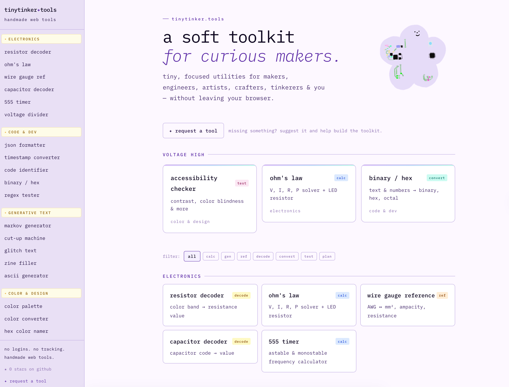
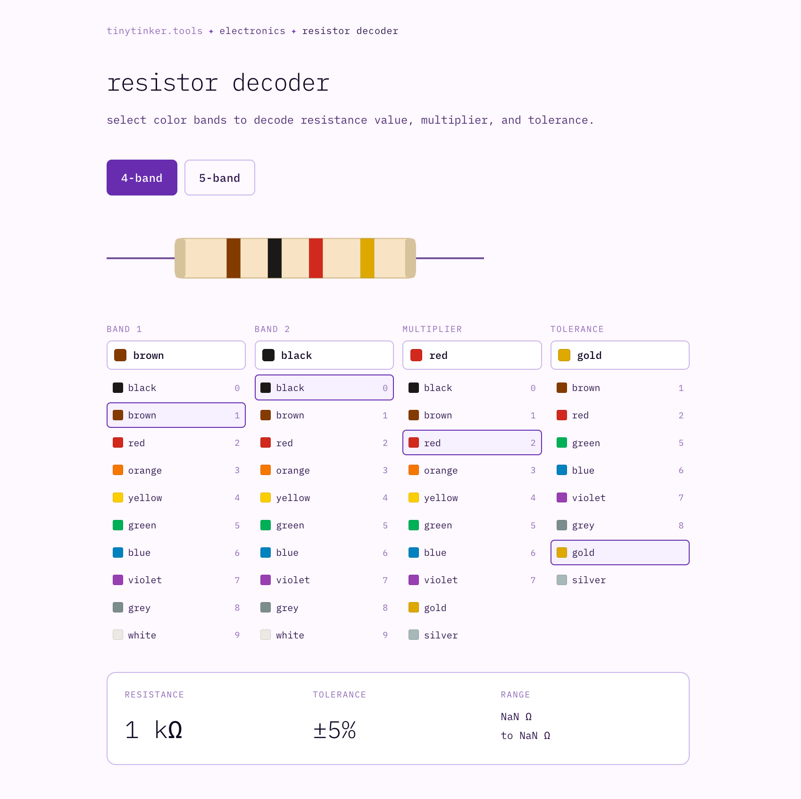
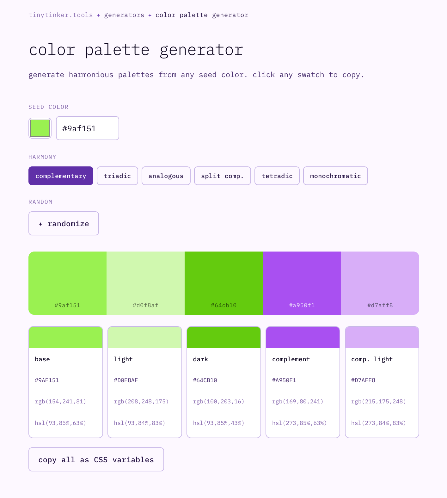
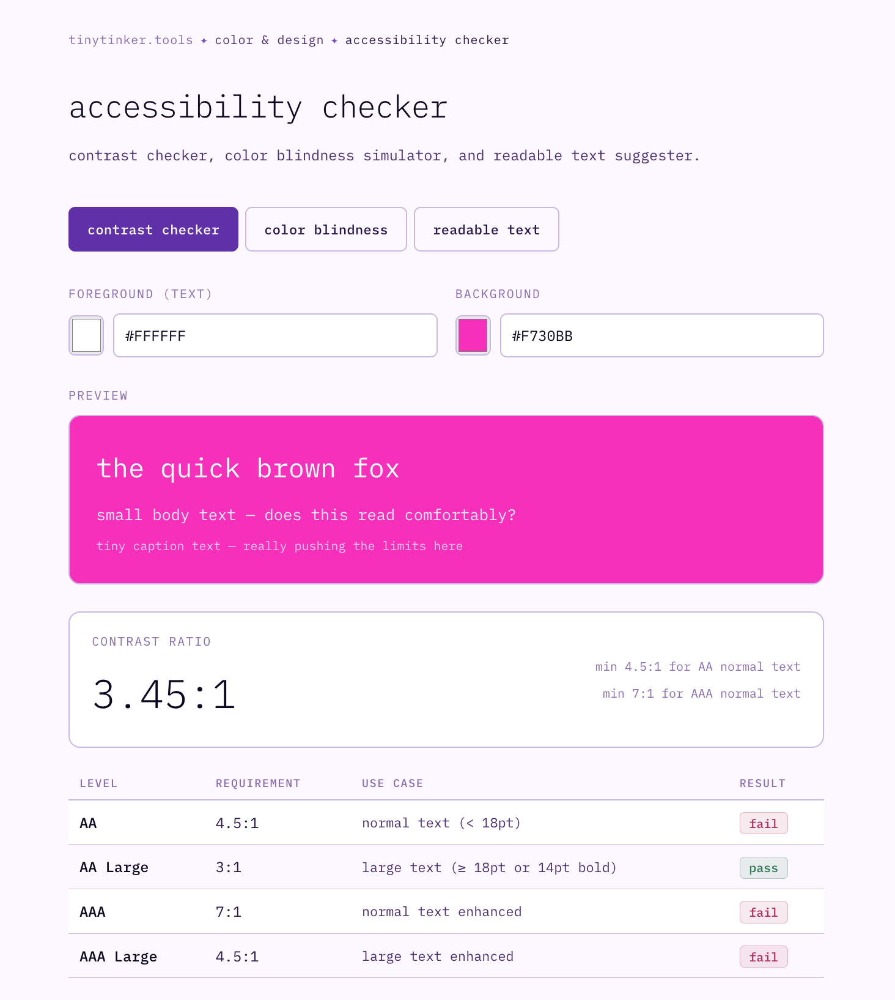
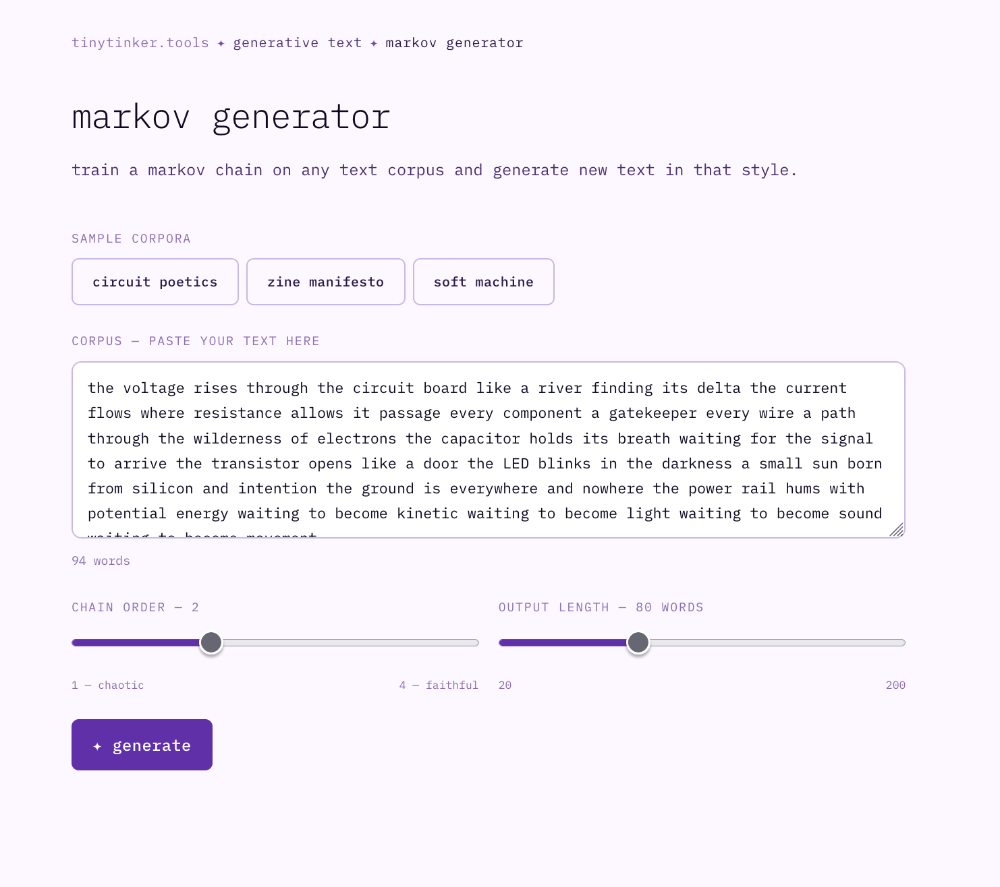
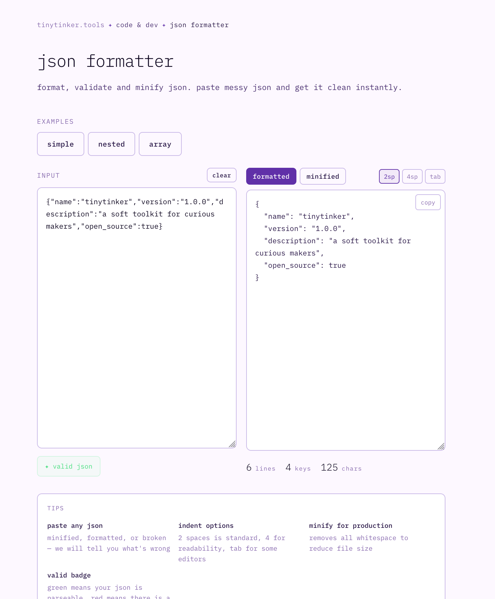
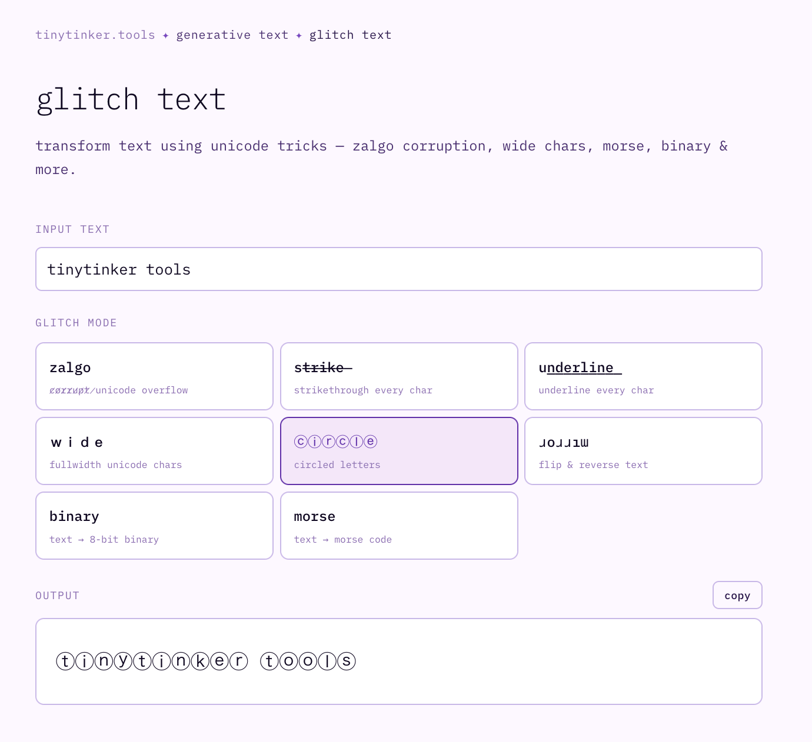

# tinytinker✦tools

**a soft toolkit for curious makers.**

tiny, focused utilities for makers, engineers, artists, crafters, creative technologists, tinkerers & you — without leaving your browser.

→ **[tinytinker.tools](https://tinytinker.tools)**

---


---

## screenshots



|                                                      |                                                  |                                                                |
| ---------------------------------------------------- | ------------------------------------------------ | -------------------------------------------------------------- |
|  |  |  |
| resistor decoder                                     | color palette gen                                | accessibility checker                                          |
|    |    |                   |
| markov generator                                     | json formatter                                   | glitch text                                                    |

---

## current tools

### electronics

| tool                 | description                                          |
| -------------------- | ---------------------------------------------------- |
| resistor decoder     | color band → resistance value + tolerance            |
| ohm's law calc       | solve for V, I, R, or P — includes LED resistor calc |
| wire gauge reference | AWG ↔ mm², ampacity, resistance per km               |
| capacitor decoder    | 2-digit, 3-digit, EIA-198 codes → value              |
| 555 timer calculator | astable & monostable frequency + timing              |
| voltage divider      | solve for Vout, R1, R2, or Vin                       |

### code & dev

| tool                   | description                                   |
| ---------------------- | --------------------------------------------- |
| code identifier        | pattern matching for 41 programming languages |
| binary / hex converter | text & numbers → binary, hex, octal, decimal  |
| regex tester           | live highlighting, named groups, replace mode |
| json formatter         | format, validate and minify json              |
| timestamp converter    | unix timestamps ↔ human readable dates        |

### generative text

| tool             | description                                |
| ---------------- | ------------------------------------------ |
| markov generator | train on any corpus, generate new text     |
| cut-up machine   | burroughs-style text reassembly            |
| glitch text      | zalgo, wide, mirror, morse, binary & more  |
| zine filler      | placeholder text in 5 flavors              |
| ascii generator  | big text, image → ascii, pattern generator |

### color & design

| tool                  | description                                              |
| --------------------- | -------------------------------------------------------- |
| color palette gen     | 6 harmony modes, click to copy                           |
| color converter       | hex ↔ rgb ↔ hsl ↔ hsv ↔ oklch ↔ cmyk                     |
| hex color namer       | poetic name + nearest css color name                     |
| color cheatsheet      | css, tailwind, material, pastel, neon, earth             |
| accessibility checker | contrast ratio, color blindness simulator, readable text |

### print & zine

| tool         | description                                  |
| ------------ | -------------------------------------------- |
| zine imposer | 8-page mini-zine fold layout + folding guide |

### measurements

| tool           | description                                               |
| -------------- | --------------------------------------------------------- |
| unit converter | length, weight, temp, fabric, data, wire, pressure, speed |

---

## stack

- **[next.js 14](https://nextjs.org)** — app router
- **[tailwind css](https://tailwindcss.com)** — utility classes
- **[ibm plex mono](https://fonts.google.com/specimen/IBM+Plex+Mono)** — the only font you need
- **100% client-side** — no backend, no database, no api keys. nothing leaves your browser.

---

## running locally

```bash
git clone https://github.com/yafira/tinytinker-tools
cd tinytinker-tools
npm install
npm run dev
```

open [http://localhost:3000](http://localhost:3000) ✦

---

## adding a tool

each tool is a single self-contained file. to add one:

1. create a folder `app/tools/your-tool-name/`
2. add `page.tsx` inside it — use `components/ToolPage.tsx` as the wrapper
3. add it to the nav in `app/layout.tsx`
4. add it to the grid in `components/ToolGrid.tsx` with a tag
5. add it to `components/FeaturedTools.tsx`
6. open a pull request

see [CONTRIBUTING.md](./CONTRIBUTING.md) for the full guide.

### tool tags

| tag       | means                        |
| --------- | ---------------------------- |
| `calc`    | computes a value from inputs |
| `gen`     | generates content            |
| `ref`     | lookup / reference table     |
| `decode`  | decodes a code or format     |
| `convert` | converts between formats     |
| `test`    | lets you test something live |
| `plan`    | helps you plan or design     |
| `guide`   | educational reference        |

### design system

the design lives in css variables in `app/globals.css`. key tokens:

```css
--bg: #fdf8ff; /* main background */
--bg-sidebar: #e8e0f5; /* sidebar */
--accent: #6030a8; /* purple accent */
--border: #c8b8e8; /* borders */
--ink: #0f0820; /* primary text */
--font-mono: "IBM Plex Mono", monospace;
```

dark mode is handled via `[data-theme="dark"]` on the html element.

please keep the aesthetic: monospace, lavender, warm, soft, handmade. ✦

---

## project structure

```
tinytinker/
├── app/
│   ├── layout.tsx              ← sidebar, nav, dark mode, mobile menu
│   ├── page.tsx                ← homepage
│   ├── globals.css             ← design tokens + global styles
│   └── tools/
│       ├── resistor/page.tsx   ← each tool is one file
│       ├── ohms-law/page.tsx
│       └── ...
├── components/
│   ├── ToolPage.tsx            ← shared wrapper (breadcrumb + header)
│   ├── FeaturedTools.tsx       ← random featured section
│   ├── ToolGrid.tsx            ← filterable tool grid
│   └── GitHubStars.tsx         ← live star count
└── public/
    ├── flower.png              ← our mascot ✦
    └── screenshots/            ← readme screenshots
```

---

## contributing

contributions are welcome! if you want to add a tool, fix a bug, or improve the docs, please read [CONTRIBUTING.md](./CONTRIBUTING.md) first.

if you have an idea but do not want to build it yourself, use the [tool request form](https://tinytinker.tools/request) or open an issue using the tool request template.

---

## license

[MIT](./LICENSE) — free to use, modify, and distribute with attribution.

copyright (c) 2026 Yafira Martinez (electrocute)

---

## crafted by

**[yafira](https://yafira.xyz)** · [electrocute.io](https://electrocute.io) · [@electrocutelab](https://instagram.com/electrocutelab)

nyu itp · design engineer & creative technologist · may 2026

_made with curiosity. no logins. no ads. handmade web tools._
